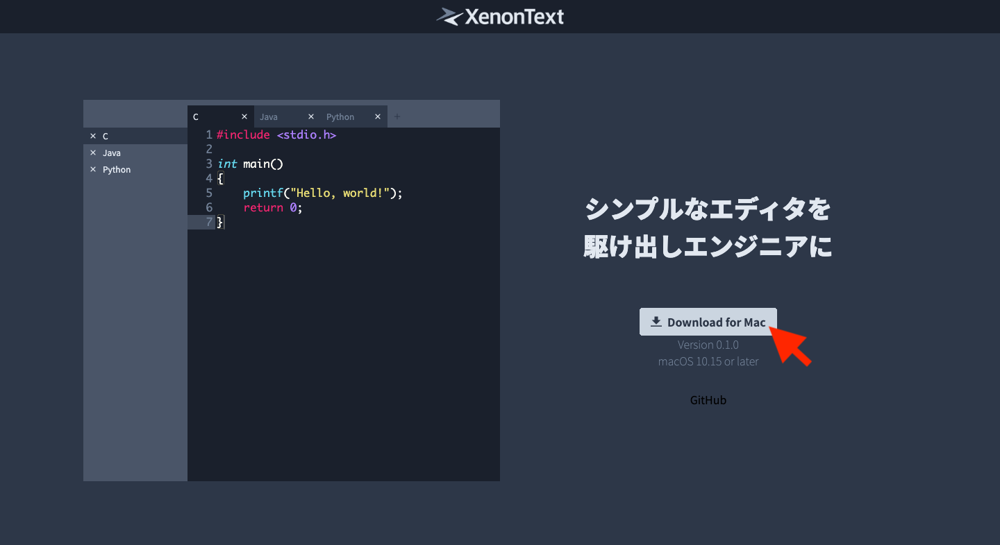
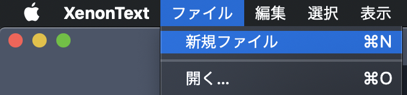

# Usage

## ダウンロードとインストール

### ダウンロード

[リリースページ](https://cdlab-sit.github.io/XenonText/) から最新版をダウンロードします。

### インストール

ダウンロードした zip ファイルを解凍し、 `XenonText.app` をアプリケーションフォルダなどに移動します。

## ファイルの操作

### 新規ファイルの作成

新規ファイルを作成するにはメニューから `ファイル > 新規ファイル` を選択します。

または、タブの余白部分をダブルクリックするか、+ ボタンをクリックすることでも操作を行えます。

::: tip
一部メニューの右側に表示されているショートカットキーを入力することでも操作を行えます。

例えば、新規ファイルの作成を行いたい場合は <kbd>⌘</kbd> + <kbd>N</kbd> を押すことでも操作を行えます。

:::

### 既存のファイルを開く

既存のファイルを開くにはメニューから `ファイル > 開く…` を選択します。

ファイルの選択ウインドウが表示されますので、開きたいファイルを選択してください。

::: warning
現在、同一のファイルを複数のタブで開くことができてしまいますが、同期が取れていないので扱いに注意していください。
:::

### 保存

#### 上書き保存

上書き保存するにはメニューから `ファイル > 保存` を選択します。

新規ファイルを作成していた場合、ファイル名と保存場所を決める必要があるため、保存先を指定するウインドウが表示されます。

#### 名前を付けて保存

名前を付けて保存するにはメニューから `ファイル > 名前を付けて保存…` を選択します。

保存先を指定するウインドウが表示されるので、ファイル名と保存場所を決めてください。

なお、名前を付けて保存を行なった場合、編集画面は名前を付けた新しいファイルに切り替わります。

### ファイルを閉じる

ファイルを閉じるにはメニューから `ファイル > ファイルを閉じる` を選択します。

または、タブやサイドバーに表示される × をクリックすることでも操作を行えます。

ファイルを開いていたタブが削除され、他のファイルに移動します。他のファイルが開かれていない場合は、新規ファイルが作成されます。

ファイルではなく、アプリケーションを閉じたい場合にはメニューから `XenonText > XenonText を終了` を選択します。

::: warning
現在、編集中のファイルでも警告がない状態でファイルを閉じれてしまいます。保存を忘れないように注意してください。
:::

## 編集・選択

執筆中

## その他

### シンタックスハイライト

プログラミング言語の構文に合わせ、文字色を変更するシンタックスハイライトが有効になっています。

ファイル拡張子に合わせた言語が自動で選択されるます。

### 文字数カウント

ファイルの文字数がウインドウ左下に表示されます。

テキストを選択している場合は選択中の文字数が表示されます。
